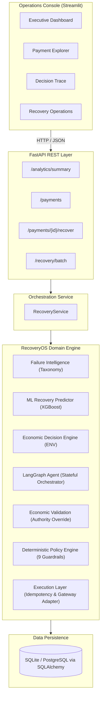
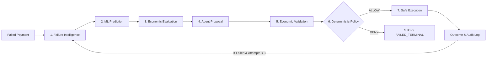

# RecoveryOS

**AI-Powered Payment Recovery Decision & Orchestration Platform**

RecoveryOS replaces naive, brute-force retry loops with an economically grounded, multi-stage orchestration pipeline. It combines ML-based failure intelligence, autonomous agent reasoning, deterministic financial guardrails, and economic optimization to decide — precisely and safely — what to do with every failed payment.

---

## 1. The Problem

In digital commerce and SaaS, **failed payments cause significant revenue leakage every day**. Common root causes range from temporary network drops and bank downtimes to insufficient funds and suspected fraud.

Traditional payment recovery systems suffer from four fundamental flaws:

- **Blind Retries:** Hammering payment gateways repeatedly without understanding root causes — incurring penalty fees, annoying customers, and triggering bank-side blocks.
- **Generic Links:** Sending payment links for non-recoverable or fraudulent transactions where the link will never work.
- **Economic Blindness:** Spending ₹10 in operational intervention costs to recover a ₹5 transaction — losing money while "recovering" it.
- **Uncontrolled Automation:** Agents or scripts that can trigger gateway actions without verifiable guardrails, creating compliance and operational risk.

---

## 2. The Solution

RecoveryOS treats payment recovery as a **constrained economic optimization problem**:

1. **Understands the failure:** Normalizes gateway error codes into actionable categories (`NETWORK`, `BANK`, `USER`, `FRAUD`) with severity levels (`LOW`, `MEDIUM`, `HIGH`, `TERMINAL`).
2. **Predicts recoverability:** A calibrated ML model computes $P(\text{recovery}) \in [0, 1]$ using point-in-time features, without data leakage.
3. **Evaluates commercial viability:** Computes **Expected Net Value (ENV)** to ensure every recovery attempt is net-profitable after intervention costs.
4. **Reasons autonomously:** A LangGraph agent proposes the optimal recovery action with a short operational rationale.
5. **Enforces economic authority:** The agent's proposal is validated against the economically viable action set. If it proposes an action with negative ENV, it is silently overridden to the best viable alternative.
6. **Applies deterministic guardrails:** An independent policy engine validates 9 non-negotiable business rules before any action is executed.
7. **Executes with idempotency:** Authorized actions are dispatched via an idempotent adapter. All decisions are immutably logged.

---

## 3. Why This Architecture Matters

> **"The AI agent proposes and orchestrates recovery actions, while deterministic policy guardrails and economic constraints maintain absolute authority over execution."**

In regulated financial environments, autonomous agents must **never have unrestricted authority over money movement**. RecoveryOS enforces three concentric layers of control:

- **Layer 1 — Economic Authority:** The Decision Engine computes which actions are economically viable *before* the agent runs. The agent cannot select an action outside this set.
- **Layer 2 — Deterministic Policy Firewall:** An independent engine evaluates 9 strict rules (retry limits, cooldown windows, fraud blocks, amount thresholds). If any rule fails, the action is **DENIED** regardless of what the agent proposed.
- **Layer 3 — Hard Safety in Execution:** The execution node independently re-checks `policy_result.allowed` before dispatching. A policy DENY can never be bypassed.

This architecture directly applies to any context where AI-driven automation touches financial decisions — including payment triage, merchant support operations, and recovery orchestration at scale.

---

## 4. Where the LLM Agent Adds Value

The LLM agent is an **advisory reasoner**, not an executor. Here is precisely what it does — and does not — do:

**Inputs the agent receives:**
- Structured context: `failure_category`, `failure_severity`, `error_code`, `amount`, `customer_risk_score`, `recovery_probability`, `attempt_number`, `seconds_since_last_attempt`, `contact_attempts_last_24h`
- The `economic_decision` block: includes the pre-computed `recommended_action`, `economically_viable_actions`, and `expected_net_value`
- The result of the previous policy check (if any), enabling awareness of past denials

**What the agent outputs:**
- A structured `AgentActionProposal`: one of `{RETRY, SEND_PAYMENT_REMINDER, SEND_PAYMENT_LINK, ESCALATE, STOP}`
- A concise `rationale` string (logged in the audit trail)
- A `confidence` score (0.0–1.0)

**Where the agent adds value:**
- **Edge case disambiguation:** Failure codes that map to multiple possible actions (e.g., `VISA:05` — Do Not Honor — could mean retry or link, depending on amount and risk)
- **Human-readable rationale:** Every decision includes an English explanation, making audit trails intelligible
- **Orchestration hub:** The agent is the single point that assembles all signals (ML, economics, prior history) and produces a coherent next step

**What the agent is explicitly NOT allowed to do:**
- It cannot execute any gateway action directly — execution is fully decoupled
- It cannot override economic constraints — if its proposal is not in `economically_viable_actions`, it is silently corrected
- It cannot bypass deterministic policy rules — the Policy Engine runs independently after the agent
- It cannot hallucinate action types — the output schema is Pydantic-validated and enum-constrained

---

## 5. System Architecture

RecoveryOS is built as a clean **Modular Monolith**:



---

## 6. End-to-End Recovery Decision Flow

Every eligible failed payment flows through a strict 7-stage lifecycle:



1. **Failure Intelligence (`src/intelligence/`):** Normalizes gateway error codes (`VISA:05`, `NPCI:U29`, `MC:54`, etc.) into `{category, severity, is_retryable}`. Covers NPCI, Visa, Mastercard, and generic codes.
2. **ML Recovery Prediction (`src/prediction/`):** XGBoost model trained on synthetic transaction data produces a calibrated $P(\text{recovery})$. Features are extracted at point-in-time to prevent leakage.
3. **Economic Decision (`src/decision/`):** Computes Expected Net Value for every eligible action:
   $$\text{ENV} = (\text{Amount} \times P(\text{recovery})) - \text{Intervention Cost}$$
   Only actions with ENV > 0 enter the viable set. The LLM can only choose from this set.
4. **Agent Proposal (`src/agent/`):** LangGraph orchestrator proposes the best action with a human-readable rationale.
5. **Economic Validation:** Agent's proposal is checked against `economically_viable_actions`. If the proposal has negative ENV, it is overridden to the recommended action. The override is logged in the audit trail.
6. **Deterministic Policy (`src/policy/`):** 9 independent rules — including max 3 attempts, 5-minute cooldown, contact frequency cap (3 per 24h), fraud/terminal blocks, and amount ceiling (₹50,000) — must all pass.
7. **Execution & Audit (`src/execution/`):** Authorized actions are dispatched idempotently and outcomes persist to the database. The full audit trail is queryable.

---

## 7. Example: A Failed Payment Through RecoveryOS

> **Synthetic example.** All values below are consistent with the simulator in `src/simulation/` and the actual decision logic in `src/decision/` and `src/policy/`.

**Payment:** ₹850, `VISA:05` (Do Not Honor), 0 prior recovery attempts, customer risk score 0.42.

**Step 1 — Failure Intelligence:**
`VISA:05` → `{category: BANK, severity: HIGH, is_retryable: True}`. This is a bank-side decline, not a terminal fraud signal.

**Step 2 — ML Prediction:**
The XGBoost model outputs $P(\text{recovery}) = 0.41$ based on amount tier, failure category, attempt count, customer risk, and time-of-day features.

**Step 3 — Economic Evaluation:**
For the eligible action set (`SEND_PAYMENT_LINK`, `SEND_PAYMENT_REMINDER`):
- `SEND_PAYMENT_LINK`: ENV = (₹850 × 0.41) − ₹3.00 = ₹345.50 − ₹3.00 = **₹342.50** ✅
- `SEND_PAYMENT_REMINDER`: ENV = (₹850 × 0.41) − ₹1.00 = **₹344.50** ✅

Both are viable. `RETRY` is not in the eligible set for `VISA:05` (Do Not Honor cannot be resolved by a silent retry).

**Step 4 — Agent Proposal:**
The LangGraph agent receives the full context and economic decision. It proposes `SEND_PAYMENT_LINK` with rationale: *"VISA:05 requires customer intervention; a payment link gives the customer a managed re-authentication path."*

**Step 5 — Economic Validation:**
`SEND_PAYMENT_LINK` is in the viable set. No override needed.

**Step 6 — Policy Check:**
All 9 rules pass: 0 prior attempts (under limit), no cooldown violation, contact count is 0 (under 3/24h cap), amount ₹850 is under the ₹50,000 ceiling, failure is not FRAUD or TERMINAL.

**Step 7 — Execution:**
`SEND_PAYMENT_LINK` is dispatched. The outcome (success/failure) is logged to `recovery_actions` and the audit trail.

**Result:** Payment marked `IN_PROGRESS`. If the customer completes the link flow, it resolves to `RECOVERED`. If not, the loop re-evaluates on next trigger with `attempt_number = 1`.

---

## 8. Operations Console (Streamlit UI)

The Streamlit UI communicates exclusively via the FastAPI REST layer and provides 4 operational views:

- **Executive Dashboard:** High-level KPIs — Revenue at Risk, Revenue Recovered, Net Recovered Value, Recovery Rate, and Outcome Breakdown with Plotly charts.
- **Payment Explorer:** Drill into individual payment failures — failure taxonomy, customer risk profile, prior attempts, and 1-click recovery execution.
- **Decision Trace:** A 7-stage visual audit pipeline. Clearly separates the Failure Diagnosis, Economic Evaluation, AI Advisory, Economic Validation status, Policy Authorization, and Execution Result. Shows whether an economic override was applied.
- **Recovery Operations:** Automated batch recovery console — process bulk failed payments with aggregate performance metrics.

---

## 9. Tech Stack

- **Backend API:** FastAPI, Pydantic v2, Uvicorn
- **Agent Orchestration:** LangGraph, LangChain Core, Stateful State Machine
- **Machine Learning:** XGBoost, Scikit-learn, Joblib, NumPy, Pandas
- **Database & Migrations:** SQLAlchemy 2.0, Alembic, SQLite (pluggable to PostgreSQL)
- **Frontend Console:** Streamlit, Plotly Express, Custom Lucide SVG Design System
- **Testing & Quality:** Pytest, Pytest-Env, Faker

---

## 10. Project Structure

```text
RecoveryOS/
├── src/
│   ├── database/         # SQLAlchemy ORM models, session & seed logic
│   ├── simulation/       # Deterministic payment gateway simulator & failure rules
│   ├── intelligence/     # Gateway error taxonomy & point-in-time feature extraction
│   ├── prediction/       # ML training dataset builder & calibrated XGBoost model
│   ├── decision/         # Economic Decision Engine (ENV) & action eligibility
│   ├── policy/           # Deterministic Safety Boundary (9 non-negotiable rules)
│   ├── agent/            # LangGraph orchestrator, state, nodes & reasoning schemas
│   ├── execution/        # Idempotent action execution adapter
│   ├── evaluation/       # Benchmark framework & results
│   ├── services/         # RecoveryService application facade
│   └── api/              # FastAPI REST application (routes & schemas)
├── ui/
│   ├── app.py            # Streamlit console entrypoint
│   ├── api_client.py     # HTTP transport client calling FastAPI
│   ├── pages/            # Multi-page dashboard views
│   ├── utils/            # SVG vector icons & formatting utilities
│   └── assets/           # Application favicon & branding assets
├── tests/                # 167 unit, integration, and closed-loop tests
├── models/               # Serialized ML model artifacts & metadata
├── migrations/           # Alembic database version control
├── docs/                 # System architecture & demo script
│   └── DEMO_FLOW_AND_SCRIPT.md
├── scripts/
│   └── run_benchmark.py  # Business impact benchmark
├── demo/                 # Demo screenshots
├── .env.example          # Environment variable template
├── requirements.txt      # Python dependencies
└── README.md
```

---

## 11. Local Setup Instructions

### 1. Prerequisites
- Python 3.10+ (3.11, 3.12, 3.13, 3.14 all supported)
- `git`

### 2. Clone & Install

```bash
# Replace with your actual repository URL
git clone https://github.com/<your-username>/RecoveryOS
cd RecoveryOS

python3 -m venv venv
source venv/bin/activate
pip install -r requirements.txt
```

### 3. Configure Environment Variables

```bash
cp .env.example .env
```

The defaults work out of the box — local SQLite, no cloud credentials required. To use a real LLM (Groq Llama-3-70B), set `USE_REAL_LLM=true` and `GROQ_API_KEY=<your-key>` in `.env`.

### 4. Initialize Database & Seed Data

```bash
# Apply schema migrations
alembic upgrade head

# Seed 1,000 realistic synthetic transactions and customer profiles
python -m src.database.seed
```

### 5. Start the FastAPI Backend (Terminal 1)

```bash
source venv/bin/activate
PYTHONPATH=. uvicorn src.api.main:app --reload --port 8000
```

- Health check: [http://localhost:8000/health](http://localhost:8000/health)
- Interactive API docs (Swagger): [http://localhost:8000/docs](http://localhost:8000/docs)

### 6. Start the Streamlit Console (Terminal 2)

```bash
source venv/bin/activate
PYTHONPATH=. streamlit run ui/app.py
```

- Open: [http://localhost:8501](http://localhost:8501)

---

## 12. Automated Testing

RecoveryOS maintains 167 tests across all architectural phases:

```bash
source venv/bin/activate
PYTHONPATH=. pytest tests/ -v
```

### Verified Test Results:
```text
======================== 167 passed, 1 warning in 4.21s ========================
```

- **Phase 1 (Database):** Models, GUID types, relationships, and cascades.
- **Phase 2 (Simulation):** Deterministic payment state transitions and failure rules.
- **Phase 3 (Intelligence):** Failure taxonomy classification and point-in-time feature extraction.
- **Phase 4 (Prediction):** ML model inference, probability calibration, and leakage prevention.
- **Phase 5 (Economics):** Gross recovery value, intervention costs, and Expected Net Value.
- **Phase 6 (Policy):** All 9 deterministic guardrail rules, boundary conditions, and priority ordering.
- **Phase 7 (Agent):** LangGraph state transitions, economic authority enforcement, and policy vetoes.
- **Phase 8 (API):** FastAPI endpoints, batch recovery, and end-to-end integration flows.
- **Phase 9 (Closed Loop):** Step-by-step state reconstruction verifying the full recursive recovery loop.

---

## 13. Benchmark & Simulation

### Running the Benchmark

The benchmark compares a naive brute-force retry strategy against RecoveryOS on the same population of 300 synthetic failed payments:

```bash
source venv/bin/activate
PYTHONPATH=. python scripts/run_benchmark.py --population 300 --seed 42
```

Both strategies run against the same deterministic simulator (`src/simulation/`) with the same seed. The naive baseline retries every payment up to the attempt limit without intelligence or economic checks. RecoveryOS applies the full 7-stage pipeline.

### Benchmark Results (Synthetic Data, 300 Payments, Seed=42)

| Metric | Naive Retry Baseline | RecoveryOS |
|---|---|---|
| Recovery Rate | 19.3% | **49.7%** |
| Recovered Value | ₹1,42,853 | ₹3,77,463 |
| Intervention Cost | ₹1,532 | ₹4,251 |
| **Net Recovered Value** | ₹1,41,321 | **₹3,73,212** |
| Avg Attempts per Payment | 1.31 | 1.00 |

**Incremental Net Value: +₹2,31,890 (+164.1%)**

> These numbers are produced by `scripts/run_benchmark.py` against the synthetic simulator. They are not derived from live transaction data. Actual improvement margins will depend on real payment gateway error distributions and customer response rates.

### Simulator Transparency

The execution engine runs against a deterministic simulator (`src/simulation/simulator.py`), not a live gateway:

- All outcomes are bound to a seeded PRNG — runs with the same seed produce identical results.
- Per-error-code recoverability probabilities (e.g., `VISA:05 → ~50%`, `NPCI:U29 → ~65%`) are explicitly configured in `src/simulation/rules.py`.
- The simulator enforces external constraints — cooldowns, idempotency windows — identically to the real policy rules.

---

## 14. Limitations & Future Work

- **Live Payment Gateway Adapter:** The execution layer runs against a high-fidelity simulator. Integrating live gateway webhooks and payout APIs is the direct next step for production deployment.
- **Model Training Data:** The XGBoost model is trained on synthetic data generated by the simulator. In production, it would need to be retrained on historical transaction logs with observed recovery outcomes as labels.
- **Continuous Learning:** Model weights are versioned artifacts in `models/`. Future phases can add a feedback loop that retrains the model on newly observed recovery outcomes.
- **Multi-Channel Orchestration:** Currently supports RETRY, SEND_PAYMENT_REMINDER, SEND_PAYMENT_LINK, and ESCALATE. Expanding to WhatsApp interactive messages, IVR calls, and localized communications is a natural extension.

### Future Work: RAG-Based Recovery Knowledge Agent

> **Not yet implemented.** Described here as a concrete planned extension.

A Retrieval-Augmented Generation layer would give the agent access to a structured knowledge base of operational documents before proposing each action:

**Knowledge Base contents:**
- Gateway error runbooks (what each error code means and what operations teams do about it)
- Retry and cooldown policy documentation, including network-specific variations
- Fraud handling guides and escalation protocols
- Historical incident summaries (e.g., "Axis Bank had a bulk decline event on 2024-03-15 affecting UPI transactions")
- Merchant support FAQs and common resolution patterns

**Retrieval approach:**
- Hybrid semantic + keyword search with metadata filters on `{gateway, error_category, action_type, severity}` to surface the most relevant documents per failure context
- Retrieved documents are passed to the agent as structured context alongside the economic and policy signals
- Retrieved sources are displayed in the Decision Trace UI alongside the agent's rationale, making the basis for each proposal fully transparent

**Key design principle:**
Retrieved content is treated as **untrusted evidence** — advisory context that informs the agent's rationale. It cannot change the eligible action set, override economic constraints, or bypass policy rules.

**Evaluation:**
A small labeled set of failure scenarios with human relevance judgments would serve as a retrieval evaluation set, measuring whether the right runbooks surface for each error code.

---

## 15. License

This project is licensed under the MIT License.
