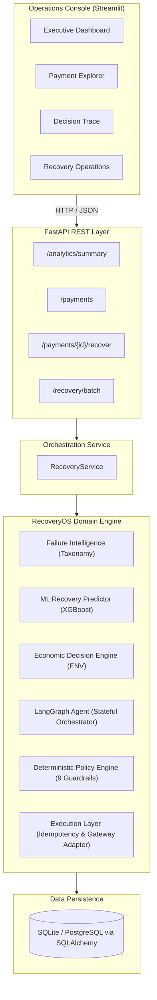
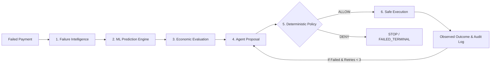

# RecoveryOS

**AI-Powered Payment Recovery Decision & Orchestration Platform**

RecoveryOS is an intelligent payment recovery decision and orchestration platform. It replaces naive, brute-force retry loops with an economically grounded pipeline combining machine learning, failure intelligence, autonomous agent reasoning, and non-negotiable deterministic financial guardrails.

---

## 1. The Problem

In digital commerce and SaaS, **failed payments cause billions of dollars in lost Gross Merchandise Value (GMV)** annually. Common root causes range from temporary network drops and bank downtimes to insufficient funds and fraud.

Traditional payment recovery systems suffer from four fundamental flaws:
- **Blind Retries:** Hammering payment gateways repeatedly without understanding root causes, incurring gateway penalty fees, annoying customers, and triggering bank blocks.
- **Generic Links:** Spamming customers with payment links for non-recoverable or fraudulent transactions.
- **Economic Blindness:** Spending ₹10 in operational intervention costs to recover a low-margin ₹5 transaction.
- **Uncontrolled Automation:** Lack of verifiable guardrails, creating compliance and operational risk.

---

## 2. The Solution

RecoveryOS treats payment recovery as a **constrained economic optimization problem**:
1. **Understands the failure:** Normalizes gateway error codes into actionable categories (`NETWORK`, `BANK`, `USER`, `FRAUD`).
2. **Predicts recoverability:** Calculates a calibrated recovery probability $P(\text{recovery}) \in [0, 1]$ using point-in-time features.
3. **Evaluates commercial viability:** Calculates **Expected Net Value (ENV)** to ensure every recovery attempt is net-profitable after intervention costs.
4. **Reasons autonomously:** An agent proposes the optimal action (`RETRY`, `SEND_PAYMENT_REMINDER`, `SEND_PAYMENT_LINK`, `ESCALATE`, or `STOP`) with an operational rationale.
5. **Enforces deterministic guardrails:** An independent policy engine validates non-negotiable business rules (e.g. cooldown periods, max 3 attempts, fraud blocks) before execution.

---

## 3. Core Engineering Principle

> **"The AI agent proposes and orchestrates recovery actions, while deterministic policy guardrails and economic constraints maintain absolute authority over execution."**

In regulated financial environments, autonomous agents must **never have unrestricted authority over money movement**. In RecoveryOS:
- The reasoning agent advises based on failure context and economics.
- The **Deterministic Policy Engine** evaluates 9 strict rules. If any rule fails, the action is **DENIED** and execution is halted.
- The agent cannot bypass, override, or hallucinate past safety guardrails.

---

## 4. System Architecture

RecoveryOS is built as a clean **Modular Monolith**:



---

## 5. End-to-End Recovery Decision Flow

When an eligible failed payment is processed, it flows through a strict 6-stage lifecycle:



1. **Failure Intelligence (`src/intelligence/`):** Classifies gateway errors into `NETWORK` (transient), `BANK` (issuer down/funds), `USER` (wrong OTP), or `FRAUD` (hard decline).
2. **Recovery Prediction (`src/prediction/`):** Calibrated ML model predicts recovery likelihood based on historical features without data leakage.
3. **Economic Decision (`src/decision/`):** Calculates Expected Net Value:
   $$\text{Expected Net Value (ENV)} = (\text{Amount} \times P(\text{recovery})) - \text{Intervention Cost}$$
4. **Agent Proposal (`src/agent/`):** LangGraph reasoner proposes the best recovery action and operational rationale using structured schemas.
5. **Deterministic Policy (`src/policy/`):** 9 safety rules enforce retry limits (max 3), cooldown windows, customer risk thresholds, and fraud blocks.
6. **Execution & Audit (`src/execution/`):** Dispatches authorized actions via an idempotent adapter and logs immutable records in `audit_logs`.

---

## 6. Operations Console (Streamlit UI)

The Streamlit UI communicates exclusively via the FastAPI REST layer and provides 4 operational views:

- **Executive Dashboard:** High-level KPIs (Revenue at Risk, Revenue Recovered, Net Recovered Value, Recovery Rate, and Outcome Breakdown).
- **Payment Explorer:** Transaction inspector to drill into individual payment failures, failure intelligence, customer risk profiles, and 1-click recovery execution.
- **Decision Trace:** A 4-stage visual audit pipeline clearly separating the AI proposal from the Deterministic Policy authorization.
- **Recovery Operations:** Automated batch recovery console to process bulk failed payments with aggregate performance tracking.

---

## 7. Tech Stack

- **Backend API:** FastAPI, Pydantic v2, Uvicorn
- **Agent Orchestration:** LangGraph, LangChain Core, Stateful State Machine
- **Machine Learning:** XGBoost, Scikit-learn, Joblib, NumPy, Pandas
- **Database & Migrations:** SQLAlchemy 2.0, Alembic, SQLite (pluggable to PostgreSQL)
- **Frontend Console:** Streamlit, Plotly Express, Custom Lucide SVG Design System
- **Testing & Quality:** Pytest, Pytest-Env, Faker

---

## 8. Project Structure

```text
RecoveryOS/
├── src/
│   ├── database/         # SQLAlchemy ORM models, session & seed logic
│   ├── simulation/       # Realistic payment gateway simulator & failure rules
│   ├── intelligence/     # Gateway failure categorization & feature extraction
│   ├── prediction/       # ML training dataset builder & calibrated XGBoost model
│   ├── decision/         # Economic Decision Engine & Expected Net Value (ENV)
│   ├── policy/           # Deterministic Safety Boundary (9 non-negotiable rules)
│   ├── agent/            # LangGraph orchestrator, state, nodes & reasoning schemas
│   ├── execution/        # Idempotent action execution adapter
│   ├── services/         # RecoveryService application facade
│   └── api/              # FastAPI REST application (routes & schemas)
├── ui/
│   ├── app.py            # Streamlit console entrypoint
│   ├── api_client.py     # HTTP transport client calling FastAPI
│   ├── pages/            # Multi-page dashboard views
│   ├── utils/            # SVG vector icons & formatting utilities
│   └── assets/           # Application favicon & branding assets
├── tests/                # 164 unit, integration, and end-to-end tests
├── models/               # Serialized ML model artifacts & metadata
├── migrations/           # Alembic database version control
├── docs/                 # System architecture & database documentation
├── scripts/              # Audit & validation scripts
├── demo/                 # Demo walkthrough guides, videos & screenshots
│   ├── DEMO_FLOW_AND_SCRIPT.md
│   ├── README.md
│   └── screenshots/
├── .env.example          # Environment variable template
├── .gitignore            # Git exclusion rules
├── requirements.txt      # Python dependencies
└── README.md             # Project documentation
```

---

<!-- 
## 9. Demo & Walkthrough

A comprehensive step-by-step video script and screen-by-screen talking points are located in:
👉 [`demo/DEMO_FLOW_AND_SCRIPT.md`](demo/DEMO_FLOW_AND_SCRIPT.md)

Place the final demo video file at:
```text
demo/recoveryos-demo.mp4
```
-->

### Key Demo Highlights:
1. **Executive Impact:** Viewing Net Recovered Value and Interventions Avoided on the dashboard.
2. **Under the Hood:** Inspecting failure categories and customer risk scores in Payment Explorer.
3. **Transparency & Safety:** Walking through the Decision Trace to prove that the AI only proposes, while deterministic policy authorizes.
4. **Scale:** Running a batch recovery of 50 failed transactions in seconds.

---

## 10. Local Setup Instructions

Follow these step-by-step instructions to run RecoveryOS locally from scratch:

### 1. Prerequisites
- Python 3.10+ (Python 3.11, 3.12, 3.13, 3.14 supported)
- `git`

### 2. Clone the Repository & Create Virtual Environment
```bash
git clone <your-repo-url>
cd RecoveryOS

python3 -m venv venv
source venv/bin/activate
pip install -r requirements.txt
```

### 3. Configure Environment Variables
Copy the `.env.example` file to `.env`:
```bash
cp .env.example .env
```
*(By default, `.env` configures local SQLite and sets `RECOVERYOS_API_URL=http://localhost:8000`. No external API keys or cloud credentials are required).*

### 4. Initialize the Database & Seed Data
```bash
# Run database schema migrations
alembic upgrade head

# Seed the database with 1,000 realistic transactions and customer profiles
python -m src.database.seed
```

### 5. Start the FastAPI Backend (Terminal 1)
```bash
source venv/bin/activate
PYTHONPATH=. uvicorn src.api.main:app --reload --port 8000
```
- API health check: [http://localhost:8000/health](http://localhost:8000/health)
- Swagger interactive API docs: [http://localhost:8000/docs](http://localhost:8000/docs)

### 6. Start the Streamlit Operations Console (Terminal 2)
In a separate terminal window:
```bash
source venv/bin/activate
PYTHONPATH=. streamlit run ui/app.py
```
- Open your browser to [http://localhost:8501](http://localhost:8501) to explore the console.

---

## 11. Automated Testing

RecoveryOS maintains a complete, high-coverage automated test suite across all 8 architectural phases:

```bash
source venv/bin/activate
pytest tests/ -v
```

### Verified Test Results:
```text
======================== 164 passed, 1 warning in 2.72s ========================
```
- **Phase 1 (Database):** Models, GUID types, relationships, and cascades.
- **Phase 2 (Simulation):** Deterministic payment state transitions and error rules.
- **Phase 3 (Intelligence):** Failure classification and point-in-time feature extraction.
- **Phase 4 (Prediction):** ML model inference, probability calibration, and leak prevention.
- **Phase 5 (Economics):** Gross recovery, intervention costs, and Expected Net Value.
- **Phase 6 (Policy):** All 9 deterministic guardrail rules, boundary conditions, and priority ordering.
- **Phase 7 (Agent):** LangGraph state transitions, loops, idempotency, and policy vetoes.
- **Phase 8 (API):** FastAPI endpoints, batch recovery, and end-to-end integration flows.

---

## 12. Limitations & Future Work

- **Live Payment Gateway Adapter:** The current execution layer operates against a high-fidelity payment simulator. Integrating live Razorpay/Stripe webhooks and payout APIs is the natural next step.
- **Continuous Online Learning:** Model weights are currently loaded from versioned artifacts (`models/`). Future phases can add feedback loops to retrain the model on observed recovery outcomes.
- **Multi-Channel Orchestration:** Adding support for automated WhatsApp interactive messages, IVR calls, and localized multi-language reminders.

---

## 13. License

This project is licensed under the MIT License.
